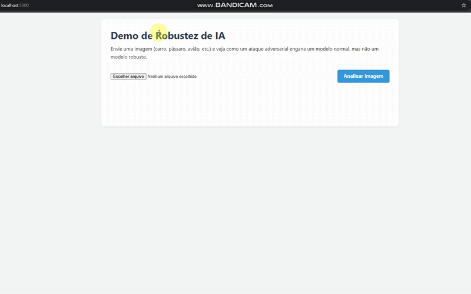

# Demo: Robustez de IA contra Ataques Adversariais

Uma aplicação web (Flask + PyTorch) que demonstra visualmente como modelos de Deep Learning podem ser enganados por "ataques adversariais" e como o "treinamento adversarial" os torna robustos.



---

## 🎯 O Problema: IAs podem ser enganadas

Modelos de visão computacional (CNNs) são incrivelmente poderosos, mas frágeis. Uma pequena perturbação na imagem, invisível aos olhos humanos, pode fazer um modelo que classifica um "Avião" com 99% de confiança passar a classificá-lo como "Navio". Isso é um **Ataque Adversarial**.

Este projeto demonstra esse fenômeno e sua principal solução: o **Treinamento Adversarial**.

## ✨ Funcionalidades

* **Upload de Imagem:** Envie qualquer imagem (de preferência de uma das classes do CIFAR-10: avião, carro, pássaro, etc.).
* **Comparação Lado a Lado:** Veja a predição de dois modelos:
    1.  **Modelo Vulnerável:** Uma CNN padrão (treinada normalmente).
    2.  **Modelo Robusto:** A mesma CNN, mas "vacinada" com Treinamento Adversarial.
* **Simulação de Ataque:** A aplicação gera um ataque (FGSM) e mostra como o Modelo Vulnerável **falha**, enquanto o Modelo Robusto **resiste**.
* **Análise de Confiança:** Visualize o "trade-off" de robustez: o modelo robusto pode ter uma confiança menor em imagens limpas, pois foi treinado para ser mais "cauteloso".

---

## 🛠️ Stack Tecnológica

* **Backend (ML & API):**
    * [**Python**](https://www.python.org/)
    * [**PyTorch**](https://pytorch.org/) (Para treinar os modelos e gerar os ataques)
    * [**Flask**](https://flask.palletsprojects.com/) (Para servir a API RESTful)
* **Frontend (UI):**
    * [**HTML5**](https://developer.mozilla.org/pt-BR/docs/Web/HTML)
    * [**CSS3**](https://developer.mozilla.org/pt-BR/docs/Web/CSS)
    * [**JavaScript**](https://developer.mozilla.org/pt-BR/docs/Web/JavaScript) (Puro, para chamadas `fetch` à API)

---

## 🚀 Como Executar Localmente

Siga estes passos para rodar o projeto na sua máquina.

### 1. Pré-requisitos

* Python 3.9+
* `pip` (gerenciador de pacotes)

### 2. Instalação

1.  **Clone o repositório:**
    ```bash
    git clone https://github.com/dicardoso/adversarial_robustness.git
    cd adversarial_robustness
    ```

2.  **Crie e ative um ambiente virtual:**
    ```bash
    # Windows
    python -m venv venv
    .\venv\Scripts\activate

    # Mac/Linux
    python3 -m venv venv
    source venv/bin/activate
    ```

3.  **Instalar as bibliotecas:**
    * No projeto já existe o `requirements.txt`, portanto apenas rode:
    ```bash
    pip install -r requirements.txt
    ```

### 3. Treine os Modelos

Antes de rodar o app, você precisa gerar os arquivos `.pth`.

1.  **Treine o modelo vulnerável (padrão):**
    ```bash
    python train_vulnerable.py
    ```
    *(Isso irá criar `modelo_vulneravel_cifar10.pth`)*

2.  **Treine o modelo robusto:**
    ```bash
    python train_robust.py
    ```
    *(Isso irá criar `modelo_robusto_cifar10.pth`)*

### 4. Rode a Aplicação

1.  **Inicie o servidor Flask:**
    ```bash
    python app.py
    ```

2.  **Acesse no navegador:**
    Abra seu navegador e vá para `http://127.0.0.1:5000`

---

## 📖 Conceitos-Chave

* **Ataque FGSM (Fast Gradient Sign Method):** O ataque usado nesta demonstração. Ele calcula o "gradiente" (a direção de maior erro) e dá um pequeno "empurrão" nos pixels da imagem nessa direção, maximizando a chance de o modelo errar.
* **Treinamento Adversarial:** A técnica de defesa. Durante o treinamento, "atacamos" o modelo repetidamente (com FGSM, PGD, etc.) e o ensinamos a classificar corretamente *mesmo* a imagem atacada. É como uma vacina.

## 🌟 Próximos Passos

A arquitetura atual usa um único modelo robusto. O próximo passo desta pesquisa é implementar um *ensemble* de modelos e usar técnicas de **seleção dinâmica baseada em incerteza** para otimizar a performance e a robustez.
